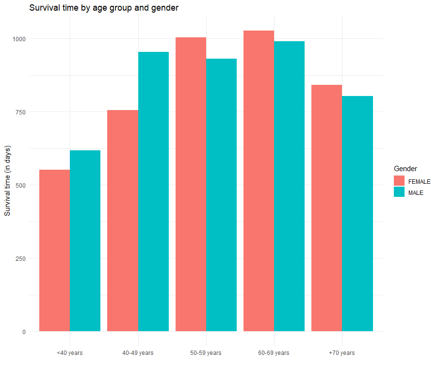
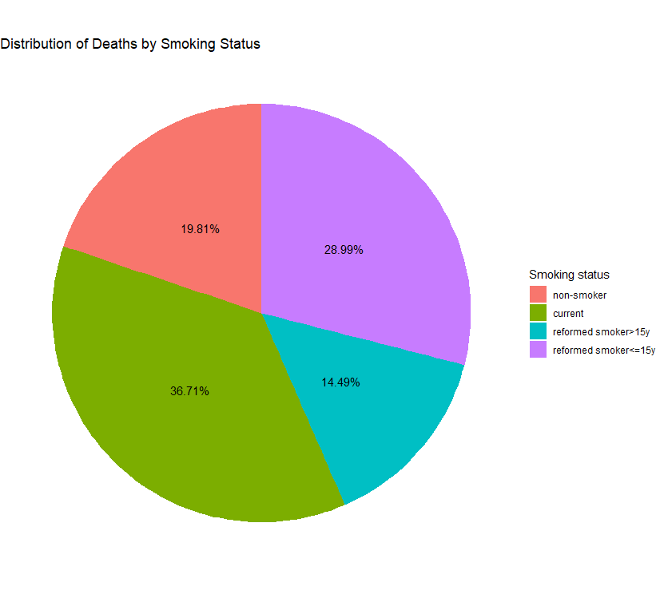
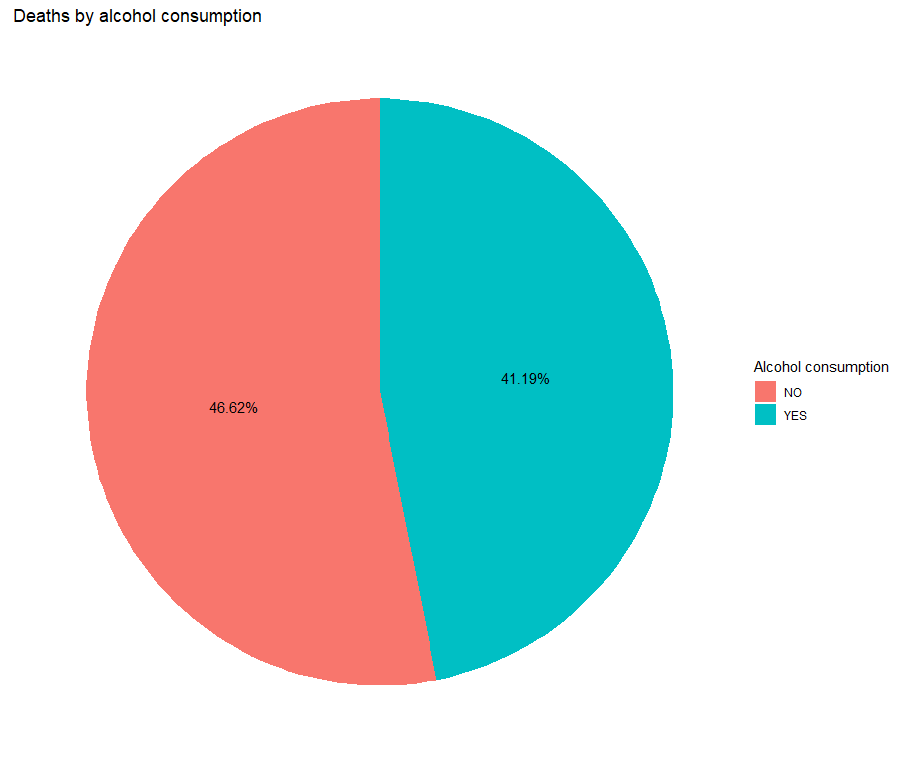
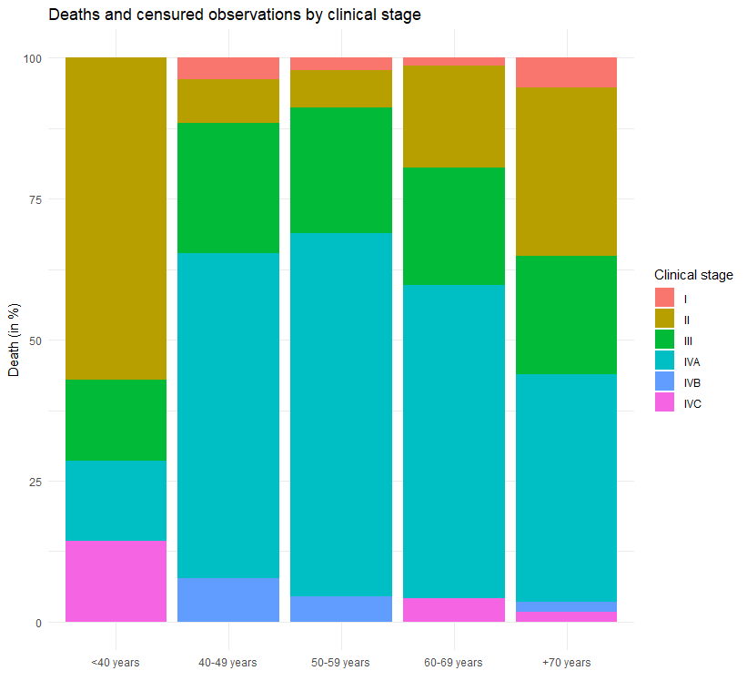
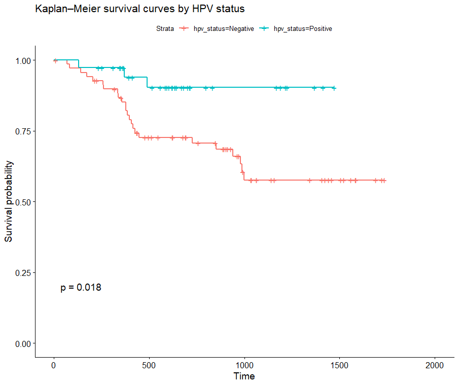
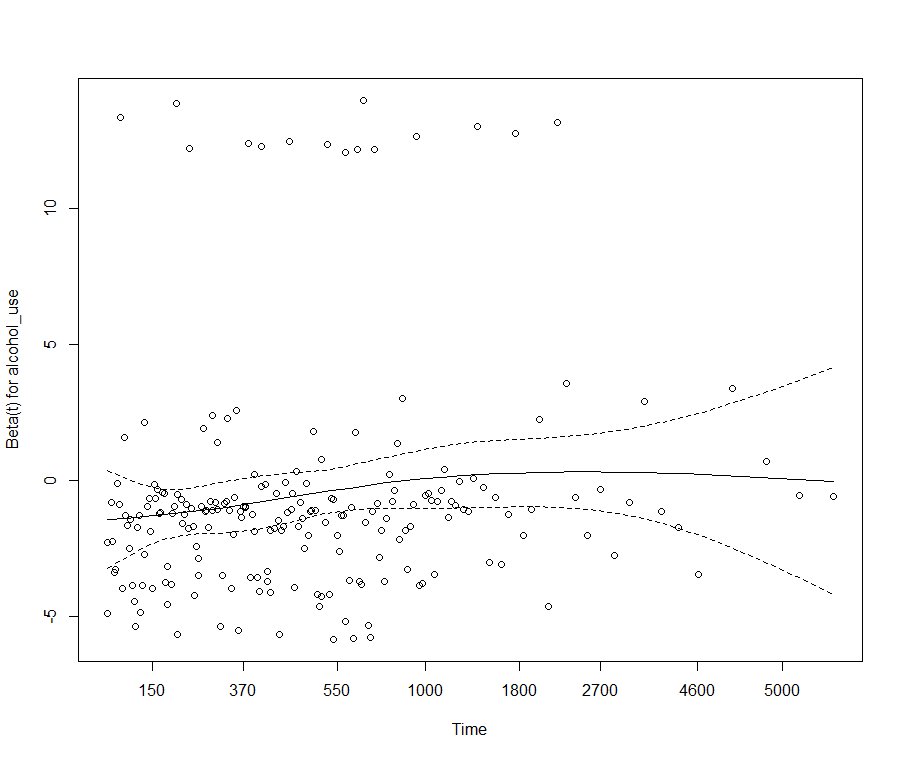

# Analyse des facteurs associés à la survie globale des patients atteints d'un carcinome épidermoïde de la tête et du cou

[🇬🇧 English](README.md) | 🇫🇷 Français

## Introduction 
Le carcinome épidermoïde de la tête et du cou (CE Tête et Cou) est un type de cancer qui se développe à partir de cellules épidermoïdes qui tapissent notamment les muqueuses de la cavité buccale, du pharynx et du larynx, ainsi que certaines régions cutanées de la tête et du cou.
Le CE Tête et Cou est caractérisé par une hétérogénéité de pronostic lié aux caractéristiques individuelles, cliniques et tumorales des patients. La variabilité du pronostic souligne l’importance d’identifier les facteurs associés à la survie globale des patients, au moyen d’une analyse de survie.

### Source de données 
TCGA (The Cancer Genome Atlas)-HNSC (Head and Neck Squamous Cell Carcinoma).

### Méthodologie
Préparation des données 
#### Préparation et homogénéisation des données initiales réalisées sur MySQL
* Préparation et homogénéisation des différentes tables
* Sélection des variables d’intérêt en tenant compte du nombre d’observations disponibles et du risque de biais de sélection.
* Utilisation du stade clinique plutôt que le stade pathologique afin de limiter l’exclusion des patients n’ayant pas fait l’objet d’une prise en charge chirurgicale ( ou non opérables).
* Gestion des données manquantes
* Constitution d’une cohorte comportant une observation par patient en retenant l’observation qui  conserve la durée de suivi la plus longue
* Préparation des données afin d’assurer l’indépendance des observations pour l’analyse de survie.

#### Analyse statistique sous R
* Nettoyage des données complémentaire et traitement des valeurs manquantes et aberrantes. 
* Exclusion des modalités qui n’apportent pas d’information dans le modèle de survie.
* Regroupement des catégories de stade clinique afin de pallier le manque d’effectif.
* Estimation des probabilités de survie par la méthode de Kaplan-Meier
* Comparaison des courbes de survie par test du log-rank 
* Estimation d’un modèle de Cox multivarié afin d’identifier les facteurs associés à la survie globale
* Exploration d’un effet d’interaction entre le statut tabagique et la consommation d’alcool, avec comparaison des modèles par test du rapport de vraisemblance.
* Analyse complémentaire de l’association entre le statut HPV et la survie (échantillon de 107 observations).
* Vérification de l’hypothèse des risques proportionnels à l’aide des résidus de Schoenfeld avec investigation des variables pouvant compromettre cette hypothèse.

## Description de l’échantillon 
Taille échantillon :483 observations
* 42,6 % des patients ont présenté l'événement au cours du suivi, tandis que 57,4 % ont été censurés.
* Effectif déséquilibré : 126 femmes contre 359 hommes 
* Le temps de suivi médian est de 656 jours et le temps de suivi maximal est de 6 417 jours (soit environ 17ans)

## Principaux résultats descriptifs
### Genre et Age :

La proportion de patients ayant présenté l'événement est plus élevée chez les femmes que chez les hommes (50,8 % contre 39,8 %). 

 Analyse de l'âge et du genre

* Les décès sont plus observés chez les femmes aux âges avancés 63% contre 52% chez les hommes. (graphe âge et genre)
* Durée de survie moyenne très comparable entre les hommes et les femmes sauf aux âges jeunes avec une durée moyenne plus élevée observé chez les hommes.
* Une tendance à une différence de survie selon le sexe est observée mais sans atteindre le seuil de significativité statistique.

### Tabac :

 Analyse du status tabagique 

* 75% des patients de l’échantillon ont déjà fumé, 33% sont des fumeurs courants.
* les fumeurs courants représentent 37% des décès lié à un CE Tête et Cou
* Bien que le test du log-rank ne mette pas en évidence de différence statistiquement significative entre les courbes de survie, le groupe des fumeurs courants présente un nombre de décès observés supérieur au nombre attendu sous l’hypothèse d’égalité des courbes.
  

### Consommation d’alcool :

 Analyse de la consommation d'alcool 

* Part des consommateurs et des non consommateurs d’alcool dans les décès très comparable (42% contre 47%) et non significativement différentes (test de proportion)
* Une association entre le statut tabagique et la consommation d’alcool est observée : la proportion de consommateurs d’alcool est plus élevée chez les fumeurs courants que chez les non-fumeurs (81 % contre 51 %).
  

### Stade clinique :

 Analyse du stade clinique 

* Les stades précoces sont concentrés aux âges jeunes mais les observations sont trop limitées pour permettre une estimation précise.
* Décès aux stades avancés (stade IVA) est majoritaire entre 49 et 69 ans et correspond aux stades le plus représenté. Des décès à des stades plus précoces sont observés après 70 ans. (graph stade)
  

### HPV : 

  Survie selon le statut HPV 

  
* Dans notre cohorte, les patients ayant un statut HPV positif présentent une survie globale meilleure que les patients HPV négatif

## Résultats de la modélisation
### Modèle de Cox global 
* L’âge est sensiblement associé à la survie : Après ajustement sur les autres variables du modèle, chaque année supplémentaire de vie  est associé à une augmentation de 2,5%  du risque instantané de décès. 
* Fumer couramment est associé à une augmentation du risque instantané de décès de 51% comparativement aux non-fumeurs.

 Résultat du test de Schoenfeld 

* Le test global des résidus de Schoenfeld ne met pas en évidence de violation significative de l’hypothèse des risques proportionnels (p = 0,425).
  

### Modèle de Cox 2 : Effet de l’association entre statut de l’HPV et la durée de survie

>**Note:** Ce modèle vise à vérifier l'association entre le statut HPV et le risque instantané de mortalité où « HPV » est la variable d'intérêt principale, même si les autres covariables ne sont pas significatives.
* Les CE Tête et cou associé à l’HPV apparaissent de meilleur pronostic : Dans l’échantillon disponible les patients présentant un statut HPV négatif ont un risque instantané de décès 3,6 fois plus élevé par rapport à celui des patients « HPV positifs ».
Cette association doit toutefois être interprétée avec prudence compte tenu du faible nombre d’observations et d’événements disponibles.
## Limites : 
* Significativité des coefficient compromis par des effectif très hétérogène qui augmente l’incertitude et l’étendue des intervalles de confiance 
* Les faibles effectifs dans certaines catégories de stade clinique, notamment les stades I et IVB–IVC, entraînent une forte incertitude autour des estimations. L’absence de significativité statistique observée pour certaines catégories ne permet donc pas de conclure à l’absence d’association avec la survie.
* L’analyse du statut HPV repose sur un sous-échantillon limité à 107 patients et 27 événements, ce qui entraîne une incertitude importante autour des estimations et limite la puissance statistique de cette analyse complémentaire.
