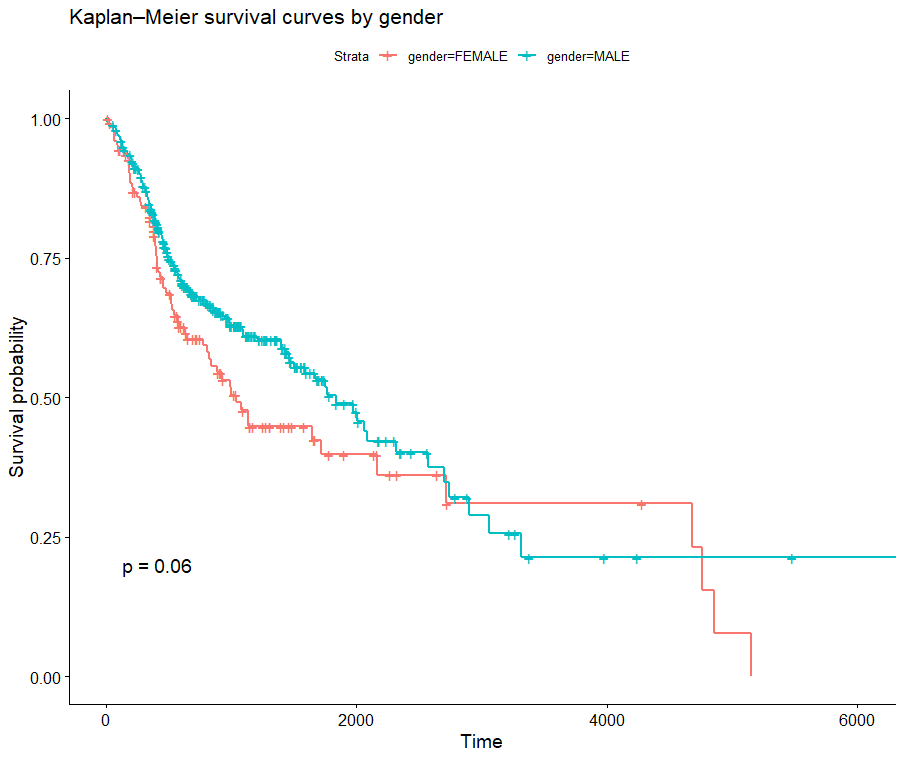

# Analysis of Factors Associated with Overall Survival in Patients with Head and Neck Squamous Cell Carcinoma
## *Analyse des facteurs associés à la survie globale des patients atteints d'un carcinome épidermoïde de la tête et du cou*

[🇬🇧 English](#english) · [🇫🇷 Français](README.fr.md)

# English

## Introduction

Head and neck squamous cell carcinoma (HNSCC) is a type of cancer that develops from squamous cells lining, in particular, the mucous membranes of the oral cavity, pharynx, and larynx, as well as certain cutaneous regions of the head and neck.

HNSCC is characterized by heterogeneous prognosis related to individual, clinical, and tumor characteristics. This variability in prognosis highlights the importance of identifying factors associated with patients' overall survival through survival analysis.

## Data Source

TCGA (The Cancer Genome Atlas) – HNSC (Head and Neck Squamous Cell Carcinoma).

## Methodology

### Data Preparation

 #### The initial data preparation and harmonization were performed using MySQL

* Preparation and harmonization of the different tables.
* Selection of variables of interest, taking into account the number of available observations and the risk of selection bias.
* Use of clinical stage rather than pathological stage in order to limit the exclusion of patients who did not undergo surgery (e.g., non-surgical patients or patients who were not eligible for surgery).
* Management of missing data.
* Construction of a cohort with one observation per patient, retaining the observation with the longest follow-up duration.
* Data preparation to ensure independence of observations for survival analysis.
  
#### Statistical Analysis in R
  
* Additional data cleaning and management of missing and outlier values.
* Exclusion of categories that did not provide sufficient information for the survival model.
* Collapsing clinical stage categories to address small sample sizes.
* Estimation of survival probabilities using the Kaplan–Meier method.
* Comparison of survival curves using the log-rank test.
* Estimation of a multivariable Cox proportional hazards model to identify factors associated with overall survival.
* Exploration of an interaction effect between smoking status and alcohol consumption, with model comparison using a likelihood ratio test.
* Additional analysis of the association between HPV status and survival (sample of 107 observations).
* Assessment of the proportional hazards assumption using Schoenfeld residuals, with investigation of variables that could compromise this assumption.
  
## Sample Description

Sample size: 483 observations.

* 42.6% of patients experienced the event during follow-up, while 57.4% were censored.
* Imbalanced sample: 126 women versus 359 men.
* Median follow-up time was 656 days, with a maximum follow-up of 6,417 days (approximately 17 years).

## Main Descriptive Results
### Sex and Age

  

Age and gender results 

  * The proportion of patients who experienced the event was higher among women than among men (50.8% vs. 39.8%).
  * Deaths were more frequently observed among women at older ages (63% vs. 52% among men).

  

 Survival's curve difference 

   
* Mean survival time was broadly comparable between men and women, except at younger ages, where a higher mean survival time was observed among men.
* A trend toward a difference in survival according to sex was observed, but it did not reach statistical significance. (Kaplan–Meier survival curve)
  

  
### Smoking
* 75% of patients in the sample had a history of smoking, and 33% were current smokers.
* Current smokers accounted for 37% of deaths among patients with HNSCC.
* Although the log-rank test did not identify a statistically significant difference between survival curves, the current smoker group had a higher number of observed deaths than expected under the assumption of equal survival curves.
  
### Alcohol Consumption
  

 Alcohol consumption's results 

   
* The proportion of alcohol consumers and non-consumers among patients who died was broadly comparable (42% vs. 47%) and not statistically significantly different (proportion test).
* An association between smoking status and alcohol consumption was observed: the proportion of alcohol consumers was higher among current smokers than among non-smokers (81% vs. 51%).
  

### Clinical Stage

 Clinical stage's results 

 
* Early-stage disease was concentrated among younger patients, but the number of observations was too limited to allow precise estimation.
* Deaths at advanced stages, particularly stage IVA, were predominant between the ages of 49 and 69 and corresponded to the most represented stage. Deaths at earlier stages were also observed among patients over 70 years of age.

### HPV Status

 Survival curve by HPV status

  
* In our cohort, patients with HPV-positive status had better overall survival than HPV-negative patients.

## Modeling Results
### Overall Cox Model
* Age was significantly associated with survival: after adjustment for the other variables in the model, each additional year of age was associated with a 2.5% increase in the instantaneous risk of death.
* Current smoking was associated with a 51% increase in the instantaneous risk of death compared with non-smokers.

 Schoenfield test results 

   
* The global test based on Schoenfeld residuals did not indicate a statistically significant violation of the proportional hazards assumption (p = 0.425). 

### Cox Model 2: Association Between HPV Status and Survival Time

<Note: This model aimed to assess the association between HPV status and the instantaneous risk of mortality, with HPV status as the main variable of interest, even though the other covariates were not statistically significant.>

* HNSCC associated with HPV appears to have a more favorable prognosis. In the available sample, patients with HPV-negative status had a 3.6-fold higher instantaneous risk of death compared with HPV-positive patients.
This association should nevertheless be interpreted with caution given the small number of available observations and events.

## Limitations
* The statistical significance of the coefficients is affected by highly unbalanced sample sizes across groups, which increases uncertainty and widens confidence intervals.
* Small sample sizes in some clinical stage categories, particularly stages I and IVB–IVC, result in substantial uncertainty around the estimates. Therefore, the absence of statistical significance observed for some * categories does not allow us to conclude that there is no association with survival.
The analysis of HPV status was based on a limited subsample of 107 patients and 27 events, resulting in substantial uncertainty around the estimates and limiting the statistical power of this additional analysis.

